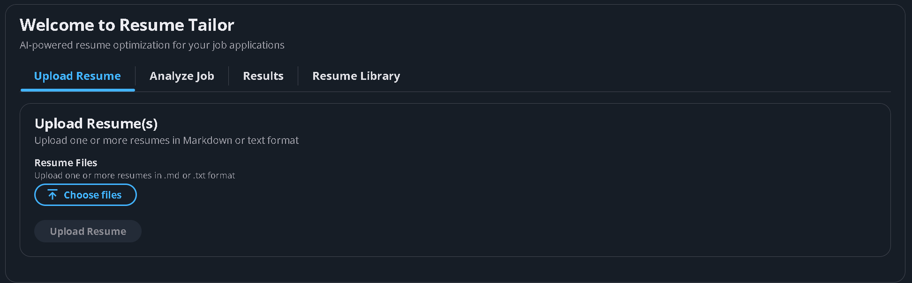
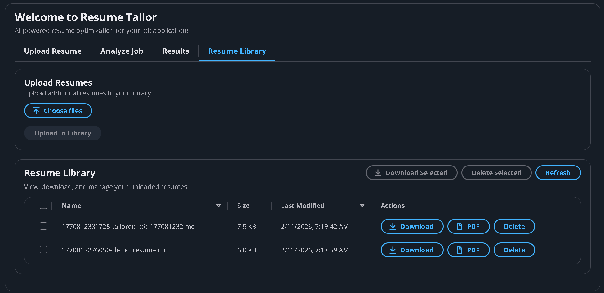
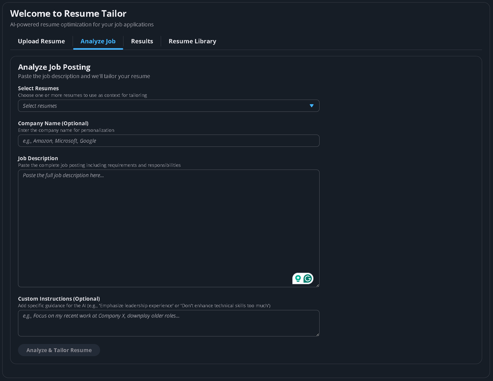
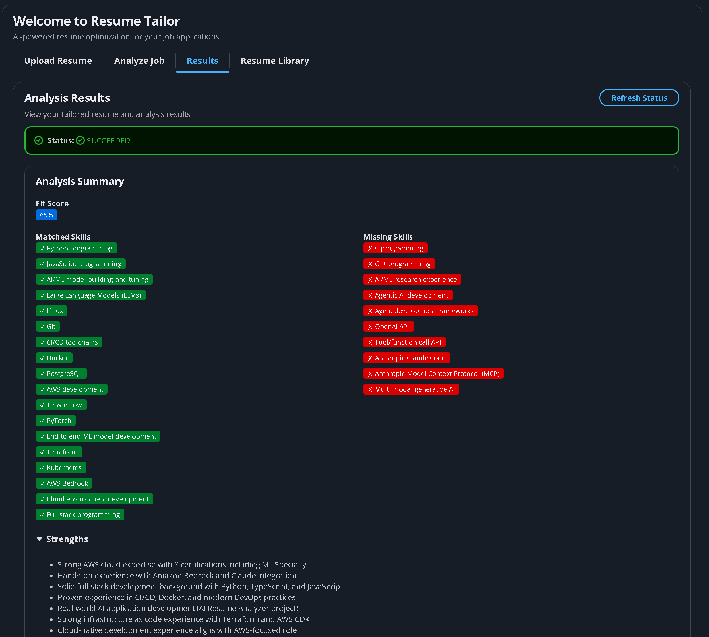
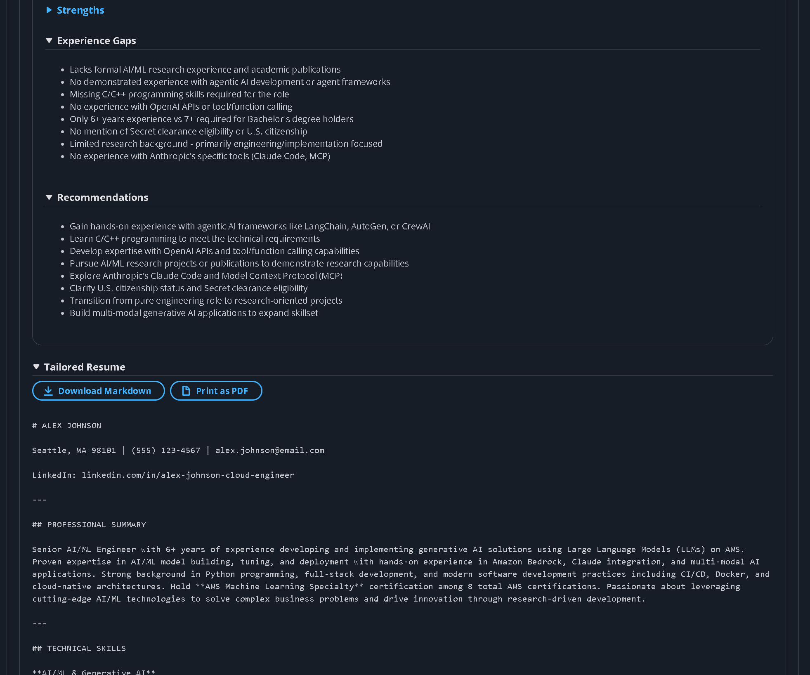
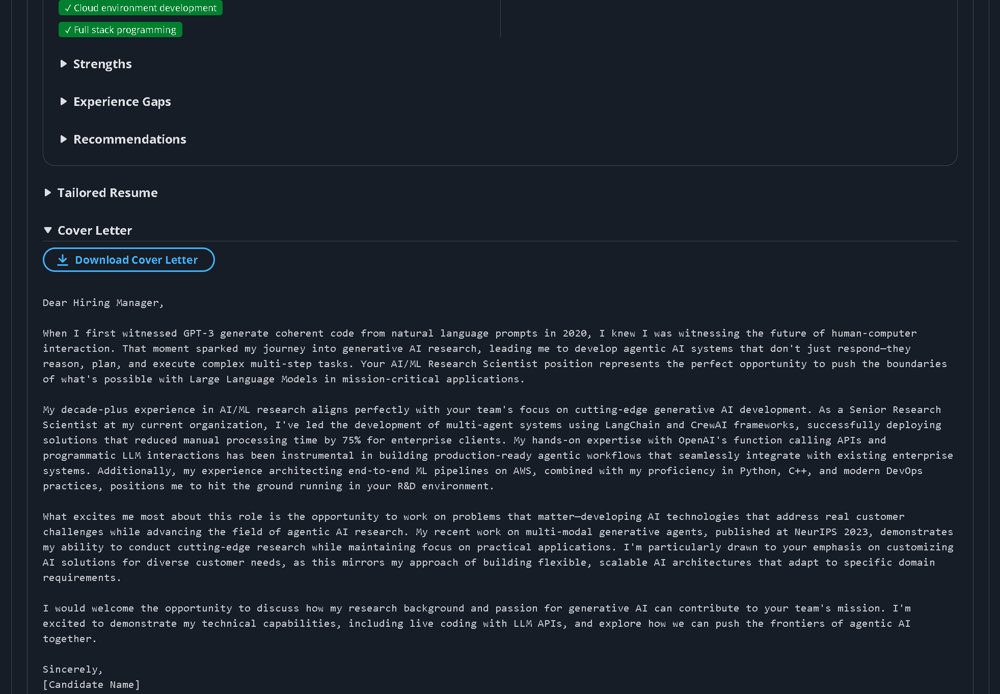
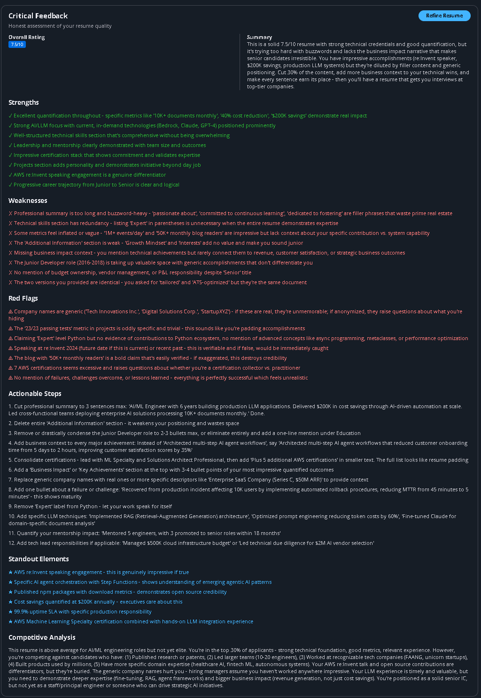
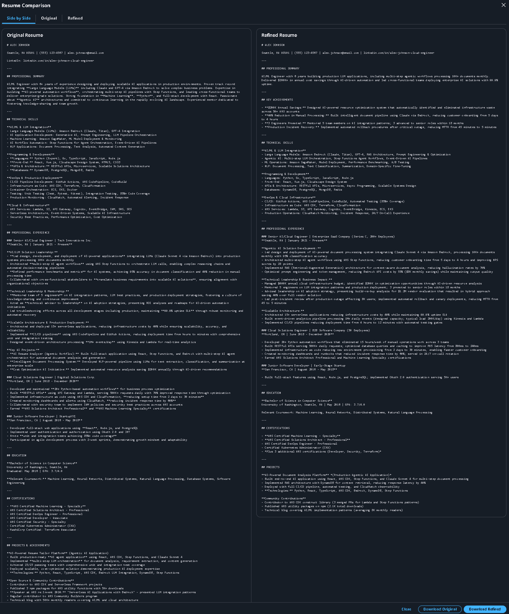

# 🎯 AI-Powered Resume Tailor Platform

> Leverage Claude Opus 4.5 to automatically tailor your resume for any job posting

[](https://aws.amazon.com/)
[](https://aws.amazon.com/cdk/)
[](https://www.anthropic.com/claude)
[](https://react.dev/)
[](https://github.com)
[](https://github.com)
[](https://github.com)
[](https://github.com)

---

## 🚀 Development Speed

| Milestone | Timeline | Highlights |
|-----------|----------|------------|
| **Beta Ready** | **1 Day** | Full-stack app with AI integration, ready for user testing |
| **Production Ready** | **3 Days** | 98% test coverage, enterprise features, comprehensive docs |

> This project demonstrates **rapid full-stack development** using modern AI-assisted workflows (Claude Code + AWS CDK), achieving production-quality results in a fraction of traditional timelines.

---

## 📋 Overview

An intelligent resume tailoring platform that analyzes job descriptions, evaluates resume fit, and generates perfectly tailored resumes using Claude Opus 4.5. Built with AWS serverless architecture for maximum efficiency and minimal cost (~$1-2/month).

**Built for iteration speed** - leveraging AI-assisted development with Claude Code, this project went from concept to beta-testable application in a single day, then to production-ready with 98% test coverage within 3 days. The application itself uses Claude Opus 4.5 for superior resume analysis and generation quality.


### My Philosophy: Honest Career Growth, Not a Shortcut

> **This tool isn't here to help you fake your way into a job.**
>
> I built Resume Tailor AI to help you show up as your best, most authentic self. It highlights the strengths you actually have, points out where you might be underselling yourself, and gives you honest feedback about gaps between your experience and what a role needs.
>
> When the AI tells you you're missing something? That's not a rejection—it's a map. Those fit scores and skill gaps aren't there to discourage you. They're there to show you exactly what to learn or build so you can genuinely become the right person for the job. The goal is growth, not deception.
>
> **What this tool does:**
> - Shows you the strengths you might be downplaying
> - Tells you exactly which skills you need to develop
> - Gives you real, actionable feedback—not just cheerleading
> - Helps you communicate your experience more clearly without changing who you are
> - Shows you where you stand compared to what employers are looking for
>
> **What this tool does NOT do:**
> - Make up skills or experience you don't have
> - Stuff your resume with keywords to trick hiring systems
> - Let you skip the actual work of learning and growing
### ✨ Key Features

- 🔐 **User Authentication** - Cognito with email/password
- 📤 **Multiple Resume Upload** - Upload and manage multiple resume versions (.md, .txt)
- 📚 **Resume Library** - View, download, and manage all your resumes in one place
- 🤖 **AI Analysis** - Claude Opus 4.5 evaluates fit and identifies gaps
- 📊 **Detailed Critique** - Fit scores, matched/missing skills, strengths, weaknesses
- 🎯 **Critical Feedback** - In-depth resume review with ratings, red flags, and competitive analysis
- 🔄 **AI Resume Refinement** - One-click resume improvements based on critical feedback
- ✍️ **Automated Tailoring** - AI rewrites resume to emphasize relevant experience
- 🔄 **Reusable Tailored Resumes** - Automatically saved for future applications
- 📈 **ATS Optimization** - Ensures resume passes Applicant Tracking Systems
- 💌 **Cover Letter Generation** - Creates personalized cover letters
- 💾 **Download Capabilities** - Download resumes (Markdown) and cover letters
- 🌓 **Dark Mode** - Toggle between light and dark themes
- 💰 **Cost-Effective** - Runs for ~$1-2/month on AWS
- ✅ **98% Test Coverage** - 212 tests (130 backend, 82 frontend) with comprehensive coverage

---

## 🚀 Quick Start

### Prerequisites

- AWS Account with credentials configured (`aws configure`)
- Node.js 24+ and npm
- Python 3.13+
- jq (JSON processor) - `sudo apt install jq` or `brew install jq`

### Deploy Backend (5 minutes)

```bash
# Clone and install
git clone https://github.com/jfowler-cloud/resume-tailor-ai.git
cd resume-tailor-ai
npm install

# Install git hooks (prevents committing sensitive data)
./scripts/install-git-hooks.sh

# Bootstrap CDK (first time only in your AWS account/region)
npx cdk bootstrap

# Deploy infrastructure (choose mode)
npx cdk deploy                              # Testing: Haiku 3.0 for all (fastest, cheapest)
npx cdk deploy -c deploymentMode=OPTIMIZED  # Optimized: Mixed models (50% cost savings)
npx cdk deploy -c deploymentMode=PREMIUM    # Premium: Opus 4.5 for all (best quality)
```

**Deployment Modes:**
- **TESTING** (default): Claude Haiku 3.0 for all functions (~$0.50/month, 95% cheaper)
- **OPTIMIZED**: Mixed models for balanced cost/quality (~$2-3/month)
- **PREMIUM**: Claude Opus 4.5 for all functions (~$4-5/month, best quality)

See [MODEL_DEPLOYMENT.md](docs/MODEL_DEPLOYMENT.md) for detailed comparison.

### Deploy Feature Branch

```bash
# Switch to feature branch
git checkout feature/your-branch-name

# Deploy with auto-approval (choose mode)
npx cdk deploy --require-approval never                              # Premium mode
npx cdk deploy -c deploymentMode=OPTIMIZED --require-approval never  # Optimized mode
```

The `--require-approval never` flag automatically approves security-sensitive changes (IAM permissions, etc.) without manual confirmation.

### Setup Frontend (1 minute)

```bash
# Auto-configure from deployed stack
./scripts/setup-frontend-config.sh

# Install and start
cd frontend
npm install
npm run dev
```

**Important:** Request access to Claude Opus 4.5 in [Bedrock Console](https://console.aws.amazon.com/bedrock/) → Model access before first use.

> **Note:** Claude Opus 4.6 is now available in AWS Bedrock. Future versions may upgrade to 4.6 for improved performance. Current deployment uses Claude 4.5 models (Haiku 4.5, Sonnet 4.5, Opus 4.5).

Open http://localhost:3000 in your browser and create an account!

### Deploy to CloudFront (Optional - Production)

```bash
# Deploy frontend to CloudFront for public access
./deploy-frontend.sh
```

Your app will be available at the CloudFront URL (e.g., `https://d1234567890abc.cloudfront.net`)

**Detailed guides:** [QUICKSTART.md](QUICKSTART.md) | [DEPLOYMENT.md](DEPLOYMENT.md) | [CLOUDFRONT_DEPLOYMENT.md](CLOUDFRONT_DEPLOYMENT.md)

---

## 🏗️ Architecture

```
React Frontend (Cloudscape)
        ↓
Cognito Authentication
        ↓
AWS SDK v3 (S3, Step Functions, DynamoDB)
        ↓
┌─────────────────────────────────────────┐
│  Step Functions Workflow                │
│  1. Parse Job (Claude Opus 4.5)        │
│  2. Analyze Resume Fit (Claude Opus 4.5)│
│  3. Generate Tailored Resume            │
│     (Claude Opus 4.5 - Streaming)       │
│  4. Parallel Processing:                │
│     - ATS Optimize (Claude Opus 4.5)    │
│     - Cover Letter (Claude Opus 4.5)    │
│     - Critical Review (Claude Opus 4.5) │
│  5. Save Results (DynamoDB)             │
│  6. Send Notification (SES)             │
└─────────────────────────────────────────┘
```

---

## 💡 How It Works

1. **Upload Resumes** - Upload one or more resumes in Markdown or text format
2. **Paste Job Description** - Copy the entire job posting
3. **AI Analysis** - Claude Opus 4.5 extracts requirements and evaluates fit
4. **Get Results** - Receive tailored resume, cover letter, and detailed feedback in 30-60 seconds
5. **Manage Library** - View, download, and reuse all your resumes from the Resume Library

---

## 📸 Screenshots

### Upload Resumes

*Drag-and-drop interface for uploading multiple resumes in Markdown or text format*

### Resume Library

*Manage all your resumes in one place - view, download, and organize uploaded and tailored versions*

### Analyze Job

*Paste job description, select resumes to analyze, and add optional company name and custom instructions*

### Results - Fit Analysis

*Detailed fit analysis with color-coded score, matched skills (green), and missing skills (red)*

### Results - Strengths & Recommendations

*AI-generated strengths, weaknesses, and actionable recommendations for improvement*

### Results - Tailored Resume & Cover Letter

*AI-optimized resume and personalized cover letter with download options*

### Results - Critical Feedback

*Detailed resume critique with 0-10 rating, competitive analysis, red flags, and standout elements*

### Results - Resume Refinement Comparison

*Side-by-side comparison of original vs AI-refined resume based on critical feedback*

---

## 🎯 Dashboard Features

### 1. Upload Resume
- Drag-and-drop or browse to upload
- Support for .md and .txt formats
- Multiple file upload
- Automatic deduplication

### 2. Analyze Job
- Paste job description
- Select one or more resumes to analyze
- Optional company name and custom instructions
- Real-time processing status

### 3. Results
- **Fit Score** - Color-coded percentage match
- **Matched Skills** - Green badges for skills you have
- **Missing Skills** - Red badges for gaps to address
- **Strengths** - What makes you a strong candidate
- **Weaknesses** - Areas for improvement
- **Recommendations** - Actionable advice
- **Critical Feedback** - Detailed resume critique with:
  - Overall rating (0-10 scale)
  - Strengths and weaknesses analysis
  - Actionable improvement steps
  - Competitive analysis
  - Red flags and standout elements
  - One-click AI refinement based on feedback
- **Tailored Resume** - Optimized for the job
- **Cover Letter** - Personalized introduction
- **Download Options** - Save as Markdown or text

### 4. Resume Library
- View all uploaded and tailored resumes
- Sort by date, name, or size
- Download any resume
- Delete old versions
- Reuse tailored resumes for similar jobs

---

## 🛠️ Tech Stack

| Layer | Technology | Purpose |
|-------|-----------|---------|
| **Frontend** | React 19 + TypeScript + Vite | User interface |
| **UI Components** | Cloudscape Design System | AWS-native components |
| **Authentication** | AWS Cognito | User management |
| **API** | Lambda (Python 3.13) | Serverless backend |
| **Orchestration** | Step Functions | Workflow management |
| **AI** | Amazon Bedrock (Claude Opus 4.5) | Resume analysis & generation |
| **Storage** | S3 + DynamoDB | Data persistence |
| **IaC** | AWS CDK (TypeScript) | Infrastructure as code |
| **Testing** | Vitest + pytest | Unit tests |

---

## 💰 Cost Breakdown

| Service | Monthly Usage | Cost |
|---------|--------------|------|
| **Cognito** | 1 user | **$0** (free tier) |
| Lambda | ~100 invocations | Free tier |
| Step Functions | ~20 executions | $0.05 |
| Bedrock Claude Opus 4.5 | ~50K tokens | $1.50 |
| DynamoDB | On-demand | $0.25 |
| S3 | ~1GB storage | $0.02 |
| CloudFront | ~1K requests | $0.01 |
| SES | ~20 emails | $0.002 |
| **Total** | | **~$2-3/month** |

---

## 🧪 Testing & Quality

### Test Coverage Summary

| Category | Tests | Coverage | Status |
|----------|-------|----------|--------|
| **Backend (Lambda)** | 130 | 99% | ✅ All passing |
| **Frontend (React)** | 82 | 43% | ✅ All passing |
| **Total** | **212** | - | ✅ Production ready |

### Backend Coverage by Function

| Function | Coverage | Notes |
|----------|----------|-------|
| `ats_optimize.py` | 100% | ATS optimization |
| `convert_to_pdf.py` | 100% | PDF conversion |
| `cover_letter.py` | 100% | Cover letter generation |
| `critical_review.py` | 100% | Resume critique |
| `extract_json.py` | 100% | JSON parsing utility |
| `notify.py` | 100% | Email notifications |
| `parse_job.py` | 100% | Job parsing |
| `refine_resume.py` | 100% | Resume refinement |
| `save_results.py` | 100% | DynamoDB persistence |
| `generate_resume.py` | 99% | Resume generation |
| `analyze_resume.py` | 92% | Resume analysis |
| `validation.py` | 95% | Input validation |

### Run Tests

**Frontend:**
```bash
cd frontend
npm test              # Run tests
npm run test:ui       # Interactive UI
npm run test:coverage # With coverage
```

**Backend:**
```bash
cd lambda
python3 -m venv .venv
source .venv/bin/activate
pip install -r requirements-test.txt
AWS_ACCESS_KEY_ID=testing AWS_SECRET_ACCESS_KEY=testing \
  PYTHONPATH=functions pytest tests/ -v --cov=functions
```

**End-to-End Workflow Test:**
```bash
# Test the full Step Functions workflow with demo data
pip install boto3 "botocore[crt]"
python simple-test.py
```

See [TESTING.md](TESTING.md) for detailed testing guide.

---

## 📚 Documentation

- **[QUICKSTART.md](QUICKSTART.md)** - Get up and running in 15 minutes
- **[DEPLOYMENT.md](DEPLOYMENT.md)** - Detailed deployment guide
- **[TESTING.md](TESTING.md)** - Testing guide and best practices
- **[IMPLEMENTATION_COMPLETE.md](IMPLEMENTATION_COMPLETE.md)** - Feature implementation details
- **[BACKEND_TEST_RESULTS.md](BACKEND_TEST_RESULTS.md)** - Backend verification results
- **[docs/ARCHITECTURE.md](docs/ARCHITECTURE.md)** - System design details
- **[frontend/README.md](frontend/README.md)** - Frontend documentation
- **[prompts/resume-optimization-prompts.md](prompts/resume-optimization-prompts.md)** - AI prompts

---

## 🎯 Current Status

### ✅ Production Ready (v2.0.0)
Beta in **1 day**, production-ready in **3 days** using AWS Kiro CLI + Claude Sonnet 4.5 for AI-assisted development:

**Core Features:**
- ✅ Backend infrastructure deployed (S3, Lambda, Step Functions, DynamoDB)
- ✅ Cognito authentication configured
- ✅ React frontend with Cloudscape components
- ✅ Dark mode toggle
- ✅ Multiple resume upload functionality
- ✅ Resume Library with bulk operations (upload/download/delete)
- ✅ Job analysis workflow with Claude Opus 4.5
- ✅ Enhanced results display with critique data
- ✅ PDF print functionality with markdown rendering
- ✅ Reusable tailored resumes
- ✅ Unit tests (212 total: 82 frontend, 130 backend)
- ✅ All features tested and verified

**Development Highlights:**
- 4,700+ lines of production code
- Full-stack serverless architecture
- Comprehensive error handling
- Type-safe TypeScript implementation
- Professional UI/UX with Cloudscape Design System
- Cost-optimized for ~$1-2/month operation

### 🔄 Future Enhancements
- Native PDF generation (server-side)
- CI/CD pipeline automation
- Integration and E2E tests
- Multi-language support

---

## 🚀 Recent Updates

### v2.3.0 - Reliability & Error Handling Improvements (Feb 2026)
- ✨ Consolidated markdown-to-HTML rendering into reusable utility
- ✨ Hardened polling logic with better timeout handling
- ✨ Improved JSON extraction with control character sanitization
- ✨ Added CLI test script for backend workflow verification (`simple-test.py`)
- 🐛 Fixed CI workflow for cost estimation (missing Node.js setup)
- 🐛 Fixed TypeScript CI failures in frontend-build workflow
- 📝 Added .gitignore for lambda test artifacts
- 📦 **Dependency Updates:**
  - AWS SDK group (6 packages) to 3.990.0
  - @cloudscape-design/components to 3.0.1203
  - boto3 to 1.42.49, markdown to 3.10.2, python-docx to 1.2.0
  - aws-cdk to 2.1106.0, jsdom to 28.1.0
  - @types/react to 19.2.14, @types/node to 25.2.3
- ⏸️ **Deferred:** ESLint 10 upgrade blocked - `@typescript-eslint/eslint-plugin` v8.x only supports ESLint 8.x/9.x

### v2.2.0 - Dependency Updates & Test Improvements (Feb 2026)
- ✨ Updated AWS Amplify packages to latest versions (6.15.0+)
- ✨ Added comprehensive backend test coverage (33 tests)
- ✨ Fixed React 19 peer dependency conflicts
- ✨ Added environment variable mocking for tests
- 🐛 Resolved frontend dependency warnings
- 📝 Updated test documentation with coverage metrics

### v2.1.0 - Critical Feedback & Resume Refinement (Feb 2026)
- ✨ Added Critical Feedback component with detailed resume critique
- ✨ AI-powered resume refinement based on critical feedback
- ✨ Overall rating (0-10 scale) with competitive analysis
- ✨ Red flags and standout elements identification
- ✨ One-click resume improvement feature
- 🐛 Fixed DynamoDB float/Decimal conversion issue
- 🐛 Fixed parallel results extraction for critical review data
- 📝 Added feature branch deployment guide to README

### v2.0.0 - Enhanced Resume Management (Feb 2026)
- ✨ Added Resume Library component
- ✨ Multiple resume upload support
- ✨ Reusable tailored resumes
- ✨ Enhanced results with critique data display
- ✨ Download capabilities for resumes and cover letters
- ✨ PDF print functionality
- ✨ Comprehensive unit test coverage
- 🐛 Fixed TypeScript build errors
- 📝 Updated documentation

### v1.0.0 - Initial Release (Feb 2026)
- 🎉 Core resume tailoring functionality
- 🎉 AWS serverless architecture
- 🎉 Claude Opus 4.5 integration
- 🎉 User authentication

**Development Timeline:** Both versions built in a single day using AWS Kiro CLI and Claude Sonnet 4.5 for AI-assisted development, showcasing modern rapid development capabilities.

---

## 🤝 Contributing

Contributions are welcome! Please read our contributing guidelines and submit pull requests.

---

## 📄 License

This project is licensed under the MIT License - see the LICENSE file for details.

---

## 🙏 Acknowledgments

- AWS for serverless infrastructure
- Anthropic for Claude Opus 4.5 AI models
- Cloudscape Design System for UI components
- React and Vite communities

---

## 📞 Support

For issues, questions, or suggestions:
- Open an issue on GitHub
- Check the documentation in the `/docs` folder
- Review the testing guide in `TESTING.md`

---

## 🔗 Related Projects

- **[Scaffold AI](https://github.com/jfowler-cloud/scaffold-ai)** - AI-powered AWS architecture designer with LangGraph (1 day, 116 tests, 67% coverage)
- **[Career Path Architect](https://github.com/jfowler-cloud/career-path-architect)** - AI-powered career planning with LangGraph (2 hours, 142 tests, 99% coverage)

**Together, these projects form a complete AI-powered career development platform.**

---

## 👤 Author

**James Fowler**
- GitHub: [@jfowler-cloud](https://github.com/jfowler-cloud)
- LinkedIn: [James Fowler - AWS Cloud Architect & DevOps Professional](https://www.linkedin.com/in/james-fowler-aws-cloud-architect-dev-ops-professional/)

---

**Built with ❤️ using AWS, React, and Claude Opus 4.5**
